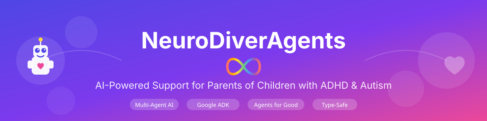

<p align="center">
  
</p>

<p align="center">
  <strong>Kaggle Agents Intensive - Capstone Project | Track: Agents for Good</strong>
</p>

<p align="center">
  <a href="https://github.com/marcuskbra/neuro-diver-agents">
    
  </a>
  <a href="https://www.kaggle.com/">
    
  </a>
  
  
</p>

---

# NeuroDiverAgents

AI-powered multi-agent system to support parents of neurodivergent children (ADHD + ASD Level 1) with behavioral
understanding, evidence-based strategies, and activity planning.

---

## 🎯 Project Overview

This capstone project demonstrates **8+ capabilities** from the 5-Day AI Agents Intensive Course:

| Day | Capability                      | Implementation                                           |
|-----|---------------------------------|----------------------------------------------------------|
| 1   | Multi-agent hierarchical system | Manager + 5 specialist agents                            |
| 2   | Tools & MCP                     | GoogleSearchTool, Custom FunctionTools, AgentTools       |
| 3   | Memory & Context                | Cross-session learning, personalization                  |
| 1   | Agent orchestration             | Manager delegates to specialists                         |
| 2   | Custom tools                    | Behavior classifier, activity database, pattern analyzer |
| 4   | Session management              | Conversation context, state tracking                     |
| 5   | **ParallelAgent**               | Concurrent expert consultation (ADHD + ASD + Dev)        |
| 5   | **SequentialAgent**             | Research pipeline (Research → Analyze → Synthesize)      |

## 🏗️ System Architecture

### Multi-Agent Hierarchical Design

This project implements a **hierarchical multi-agent system** using Google ADK with type-safe Pydantic models
throughout.

**Run the cell below to see the interactive architecture diagram!**

### Agent Hierarchy Overview

```
                    ┌─────────────────────────────────────────────────────────┐
                    │            🎯 PARENTING COORDINATOR                     │
                    │                   (Manager Agent)                       │
                    │  ━━━━━━━━━━━━━━━━━━━━━━━━━━━━━━━━━━━━━━━━━━━━━━━━━━━━━━ │
                    │  • Orchestrates all specialist agents                   │
                    │  • Routes questions to appropriate experts              │
                    │  • Synthesizes multi-perspective responses              │
                    │  • Tools: All 5 specialists as AgentTools               │
                    └───────────────────────────┬─────────────────────────────┘
                                                │
            ┌───────────────┬───────────────────┼───────────────────┬──────────────────┐
            │               │                   │                   │                  │
            ▼               ▼                   ▼                   ▼                  ▼
   ┌─────────────┐  ┌─────────────┐   ┌─────────────┐   ┌─────────────┐   ┌─────────────────┐
   │   🧠 ADHD   │  │  🌈 ASD     │   │  📊 DEV     │   │  💾 MEMORY  │   │  📅 ACTIVITY    │
   │   Expert    │  │  Expert     │   │  Expert     │   │  Agent      │   │  Planner        │
   │─────────────│  │─────────────│   │─────────────│   │─────────────│   │─────────────────│
   │ Executive   │  │ Sensory     │   │ Age-typical │   │ Pattern     │   │ Structured      │
   │ function    │  │ processing  │   │ milestones  │   │ learning    │   │ activity plans  │
   │─────────────│  │─────────────│   │─────────────│   │─────────────│   │─────────────────│
   │ 🔧 Tools:   │  │ 🔧 Tools:   │   │ 🔧 Tools:   │   │ 🔧 Tools:   │   │ 🔧 Tools:       │
   │ • Search    │  │ • Search    │   │ • Search    │   │ • Pattern   │   │ • Activity      │
   │ • Behavior  │  │ • Behavior  │   │             │   │   Analyzer  │   │   Planner       │
   │   Classifier│  │   Classifier│   │             │   │             │   │                 │
   └─────────────┘  └─────────────┘   └─────────────┘   └─────────────┘   └─────────────────┘
```

### Specialist Agents

| Agent                   | Focus Area         | Tools                            | Key Capabilities                                  |
|-------------------------|--------------------|----------------------------------|---------------------------------------------------|
| 🧠 **ADHD Expert**      | Executive function | GoogleSearch, BehaviorClassifier | Working memory, task initiation, impulse control  |
| 🌈 **ASD Expert**       | Sensory processing | GoogleSearch, BehaviorClassifier | Routines, social interaction, flexibility         |
| 📊 **Dev Expert**       | Milestones         | GoogleSearch                     | Age-appropriate expectations, typical development |
| 💾 **Memory Agent**     | Personalization    | PatternAnalyzer                  | Session history, successful strategies            |
| 📅 **Activity Planner** | Structured plans   | ActivityPlanner                  | Materials, timing, success criteria               |

**Type-Safe Design**: All models use Pydantic v2 with strict type checking, discriminated unions for results, and
comprehensive validation.

### Agent Specializations

**1. ADHD Expert**

- Executive function challenges (working memory, task initiation, organization)
- Attention regulation and impulse control
- Tools: GoogleSearchTool, BehaviorClassifier
- Searches: CHADD, Russell Barkley research, ADDitude Magazine

**2. ASD Expert**

- Sensory processing differences
- Communication patterns and social interaction
- Need for routine and predictability
- Tools: GoogleSearchTool, BehaviorClassifier
- Searches: Autism Speaks, CDC autism resources, Temple Grandin

**3. Developmental Expert**

- Age-appropriate expectations for 8-year-olds
- Typical developmental milestones
- Distinguishing neurodivergent from age-typical behaviors
- Tools: GoogleSearchTool
- Searches: CDC milestones, AAP guidelines

**4. Memory Agent**

- Pattern learning from session history
- Identifying what works for THIS specific child
- Personalized recommendations based on past successes
- Tools: PatternAnalyzer (custom)

**5. Activity Planner**

- Structured activity plans with materials and setup
- Executive function, transitions, homework, engagement activities
- Incorporates past successful approaches
- Tools: ActivityPlanner (custom)

**6. Parenting Coordinator (Manager)**

- Orchestrates all 5 specialist agents
- Routes questions to appropriate specialists
- Synthesizes insights from multiple perspectives
- Maintains empathetic, supportive communication
- Tools: All 5 specialists as AgentTools

### ADK Orchestration Patterns

This project implements advanced ADK orchestration patterns for multi-agent coordination:

#### ParallelAgent: Concurrent Expert Consultation

```python
from google.adk.agents import ParallelAgent
from capstone.agents import create_adhd_expert, create_asd_expert, create_developmental_expert

# Consult all three specialists simultaneously
expert_panel = ParallelAgent(
    name="parallel_expert_panel",
    description="Consults ADHD, ASD, and developmental experts in parallel",
    sub_agents=[create_adhd_expert(), create_asd_expert(), create_developmental_expert()],
)
```

**Use Cases**:
- Get multiple perspectives on a behavior simultaneously
- Reduce latency when consulting multiple specialists
- Compare recommendations from different domains

#### SequentialAgent: Structured Research Pipeline

```python
from google.adk.agents import SequentialAgent
from capstone.agents import create_adhd_expert, create_asd_expert, create_developmental_expert

# Create sequential research pipeline
# Flow: ADHD Expert → ASD Expert → Developmental Expert
pipeline = SequentialAgent(
    name="research_pipeline",
    description="Sequential pipeline: Research → Analyze → Synthesize",
    sub_agents=[create_adhd_expert(), create_asd_expert(), create_developmental_expert()],
)
```

**Use Cases**:
- Deep investigation workflows requiring multiple stages
- Building on previous analysis (Research → Analyze → Synthesize)
- Structured problem-solving with clear stages

---

## 📁 Project Structure

```
neurodiveragents/
├── src/
│   └── capstone/
│       ├── models/
│       │   ├── behavior.py       # BehaviorInput, BehaviorAnalysis, Enums
│       │   ├── activity.py       # ActivityPlan, ActivityRequest
│       │   ├── strategy.py       # Strategy, BehaviorResponse
│       │   ├── memory.py         # SessionOutcome, BehaviorPattern
│       │   └── results.py        # ToolSuccess, ToolError, ToolResult
│       ├── tools/
│       │   ├── behavior_classifier.py   # Type-safe behavior analysis
│       │   ├── activity_planner.py      # Type-safe activity planning
│       │   └── pattern_analyzer.py      # Type-safe pattern recognition
│       ├── agents/
│       │   ├── coordinator.py           # Manager/coordinator agent
│       │   ├── specialist_factory.py    # Factory for specialist agents
│       │   ├── agent_configs.py         # Agent configurations and prompts
│       │   ├── tool_wrappers.py         # ADK tool wrapper functions
│       │   ├── tool_formatters.py       # Output formatting utilities
│       │   ├── specialist_helpers.py    # Specialist consultation helpers
│       │   └── retry_config.py          # API retry configuration
│       └── infrastructure/
│           └── agent_factory.py         # AgentFactory with caching
├── tests/
│   ├── unit/                    # Unit tests (237 tests, 94% coverage)
│   └── conftest.py              # Test fixtures
├── docs/
│   ├── api_reference.md         # Complete API documentation
│   ├── architecture_guide.md    # System architecture guide
│   ├── typing_guide.md          # Type safety patterns
│   ├── testing_guide.md         # Testing best practices
│   └── best_practices.md        # Python best practices
├── demo_tools.py                # Demonstration of type-safe tools
├── demo_agents.py               # Multi-agent system demo
├── demo_comprehensive.py        # Full capability demonstration
├── pyproject.toml               # Dependencies and configuration
└── README.md                    # This file
```

---

## 🚀 Setup

### Prerequisites

- Python 3.12+
- `uv` (recommended) or `pip`

### Installation

```bash
# Install dependencies
uv sync

# Or with pip
pip install -e ".[dev]"
```

### Set up Google API Key

```bash
export GOOGLE_API_KEY="your-api-key-here"
```

---

## 🧪 Demos

### Demo 1: Type-Safe Tools

Run the foundational tools demo:

```bash
uv run python demo_tools.py
```

This demonstrates:

1. **Behavior Classification**: Type-safe analysis of ADHD/ASD/age-typical factors
2. **Activity Planning**: Structured activity plans with complete preparation
3. **Pattern Analysis**: Learning from past session outcomes

### Demo 2: Multi-Agent System (Standard)

Run the standard ADK multi-agent demo:

```bash
export GOOGLE_API_KEY="your-api-key-here"
uv run python demo_agents.py
```

This demonstrates:

1. **Scenario 1**: Behavioral analysis with specialist consultation
2. **Scenario 2**: Activity planning with memory integration
3. **Scenario 3**: Pattern learning from session history

**Duration**: ~5 minutes | **Scenarios**: 3

### Demo 3: Comprehensive System (Recommended for Presentations)

Run the comprehensive demo with all capabilities:

```bash
export GOOGLE_API_KEY="your-api-key-here"
uv run python demo_comprehensive.py
```

This demonstrates **all 6 scenarios** showcasing:

1. **Multi-Factor Analysis**: ADHD vs ASD vs age-typical behavior
2. **Sensory Processing**: ASD sensory meltdown analysis
3. **Activity Planning**: Structured bedtime routine creation
4. **Pattern Learning**: Memory agent analyzing session history
5. **Impulsivity Assessment**: ADHD + developmental expert collaboration
6. **Complex Multi-Factor**: ALL 5 specialists working together

**Features**:

- 🎨 Color-coded output for clarity
- 📊 Detailed metrics tracking (agents, tools, performance)
- 🔧 All 3 custom tools demonstrated
- 👥 All 5 specialist agents activated
- ⚡ Smart retry handling and rate limit protection
- 📈 Comprehensive analytics summary

**Duration**: ~12 minutes | **Scenarios**: 6 | **Full Capabilities**: Yes

**See**: `DEMO_GUIDE.md` for complete demo documentation

**Showcases**:

- Multi-agent hierarchical orchestration (Manager + 5 specialists)
- AgentFactory dependency injection (no global state)
- Custom function tools with Pydantic validation
- Google Search integration (GoogleSearchTool)
- Cross-session learning and personalization
- Production-ready error handling and metrics

---

## 🔍 Type Safety Features

This project follows **rigorous Python type safety best practices**:

### ✅ No `Dict[str, Any]`

All domain data uses Pydantic models with strict validation:

```python
class BehaviorInput(BaseModel):
    description: str = Field(..., min_length=10, max_length=1000)
    time_of_day: TimeOfDay  # Enum, not string!
    activity_type: ActivityType  # Enum, not string!
```

### ✅ Discriminated Unions for Results

Tool results are always Success OR Error, never mixed:

```python
ToolResult = Union[ToolSuccess, ToolError]

result = classify_behavior(input)
if is_success(result):  # Type narrows to ToolSuccess
    print(result.data)
else:  # Type narrows to ToolError
    print(result.error_code, result.error_message)
```

### ✅ Enums Instead of Strings

No typos, full autocomplete:

```python
class ActivityType(str, Enum):
    HOMEWORK = "homework"
    TRANSITIONS = "transitions"
    BEDTIME_ROUTINE = "bedtime_routine"
```

### ✅ Field Validation

Automatic validation on construction and assignment:

```python
behavior = BehaviorInput(
    description="Hi",  # ❌ ValidationError: too short (min 10)
    time_of_day="morning",  # ❌ ValidationError: wrong type (needs enum)
)
```

---

## 📊 Quality Checks

```bash
# Type check
uv run ty check src/

# Lint
uv run ruff check src/

# Format
uv run ruff format src/

# Run tests (when added)
uv run pytest
```

---

## 🎯 Use Cases

### 1. Behavioral Analysis

**Input**: Description of challenging behavior with context
**Output**: ADHD/ASD/age-typical factor analysis + actionable strategies

### 2. Activity Planning

**Input**: Activity goal (homework, transitions, engagement)
**Output**: Complete plan with materials, setup, timing, success criteria

### 3. Pattern Recognition

**Input**: Session history with outcomes
**Output**: Identified patterns, successful strategies, common triggers

---

## ⚠️ Disclaimer

This is a **parenting support tool, NOT medical advice**. Always consult healthcare professionals for medical concerns
about your child's development or behavior.

---

## ✅ Implemented Features

1. ✅ Type-safe Pydantic models with strict validation
2. ✅ Three custom tools (Behavior Classifier, Activity Planner, Pattern Analyzer)
3. ✅ Five specialist agents (ADHD, ASD, Developmental, Memory, Activity Planner)
4. ✅ Manager coordinator agent with orchestration logic
5. ✅ Multi-agent hierarchical system with AgentTool pattern
6. ✅ Google Search integration for evidence-based strategies (ADHD, ASD, Dev experts)
7. ✅ Cross-session learning with pattern analysis
8. ✅ Comprehensive demo scenarios
9. ✅ **ParallelAgent** for concurrent expert consultation
10. ✅ **SequentialAgent** for structured research pipelines
11. ✅ **237 unit tests with 94% coverage**

## 📓 Kaggle Notebook

**Ready for submission!** A complete Jupyter notebook demonstration is available at:

```
notebooks/kaggle_capstone_demo.ipynb
```

**Features**:

- ✅ Complete setup instructions for Kaggle environment
- ✅ API key configuration with Kaggle secrets
- ✅ Three interactive demo scenarios
- ✅ Architecture explanations with diagrams
- ✅ Comprehensive capability showcase (6+ ADK features)
- ✅ Results analysis and conclusions

**To use on Kaggle**:

1. Upload the `src/` directory to your Kaggle notebook
2. Add your Google AI API key as a Kaggle secret (`GOOGLE_API_KEY`)
3. Import the notebook file
4. Enable internet access in settings
5. Run all cells

See [`notebooks/README.md`](notebooks/README.md) for detailed instructions.

---

## 🔮 Future Enhancements

1. ✅ ~~Create Kaggle notebook with inline demonstrations~~ **DONE**
2. ✅ ~~Add comprehensive testing suite~~ **DONE** (237 tests, 94% coverage)
3. ✅ ~~Document ADK capabilities showcase~~ **DONE**
4. ✅ ~~Add real-world scenario examples~~ **DONE**
5. ✅ ~~ParallelAgent & SequentialAgent patterns~~ **DONE**
6. 🚧 Performance evaluation and metrics
7. 🚧 Video demonstration (optional)

---

## 📝 License

MIT License - This is an educational project for the Kaggle Agents Intensive Capstone.

---

## 🙏 Acknowledgments

- Google & Kaggle for the ADK framework and Agents Intensive Course
- CHADD, Autism Speaks, CDC for evidence-based resources
- Parents of neurodivergent children for inspiring this meaningful use case
