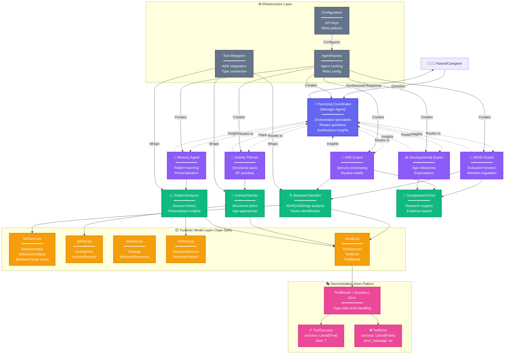
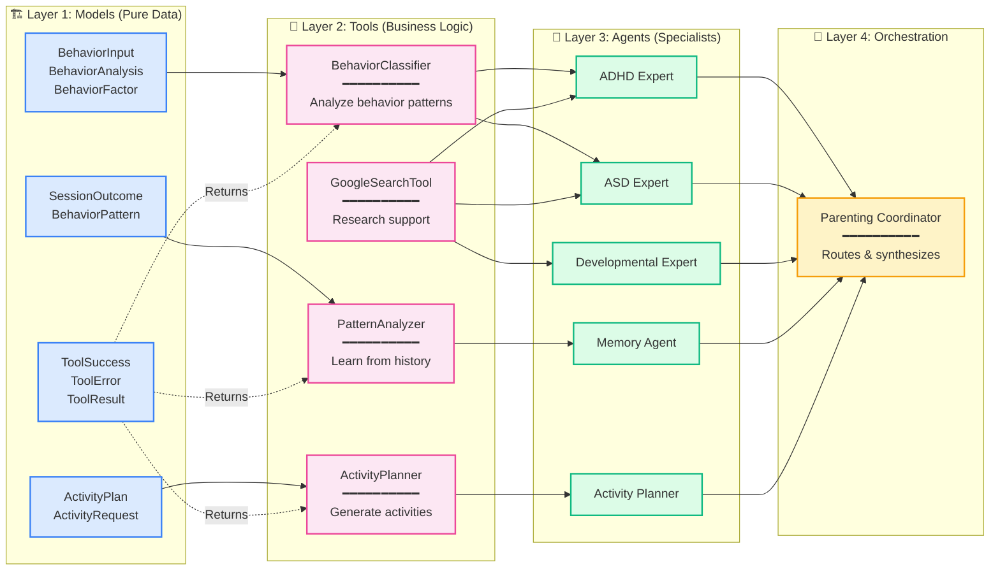
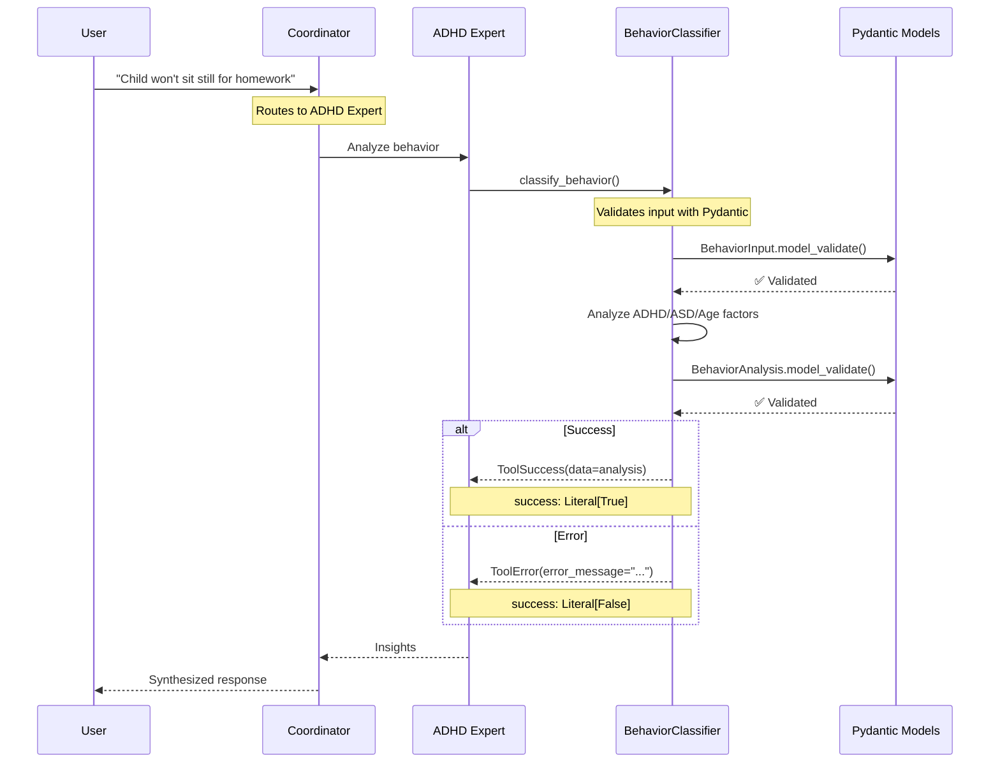
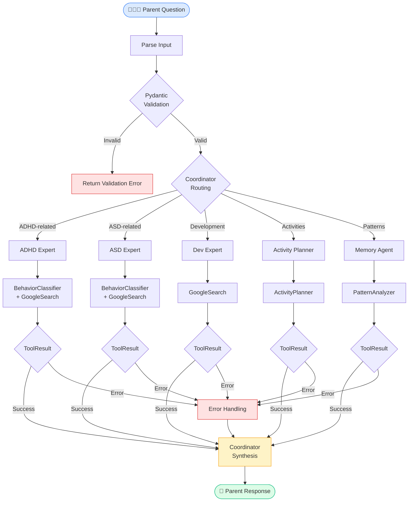
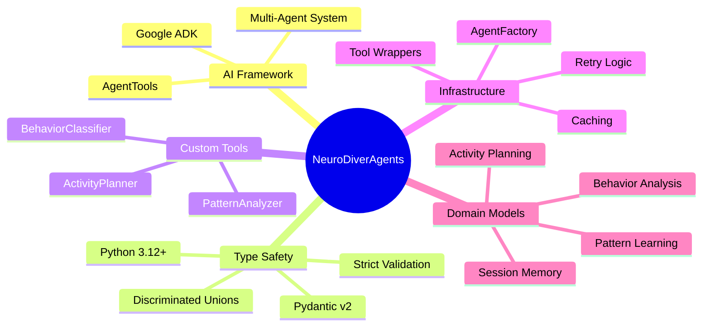
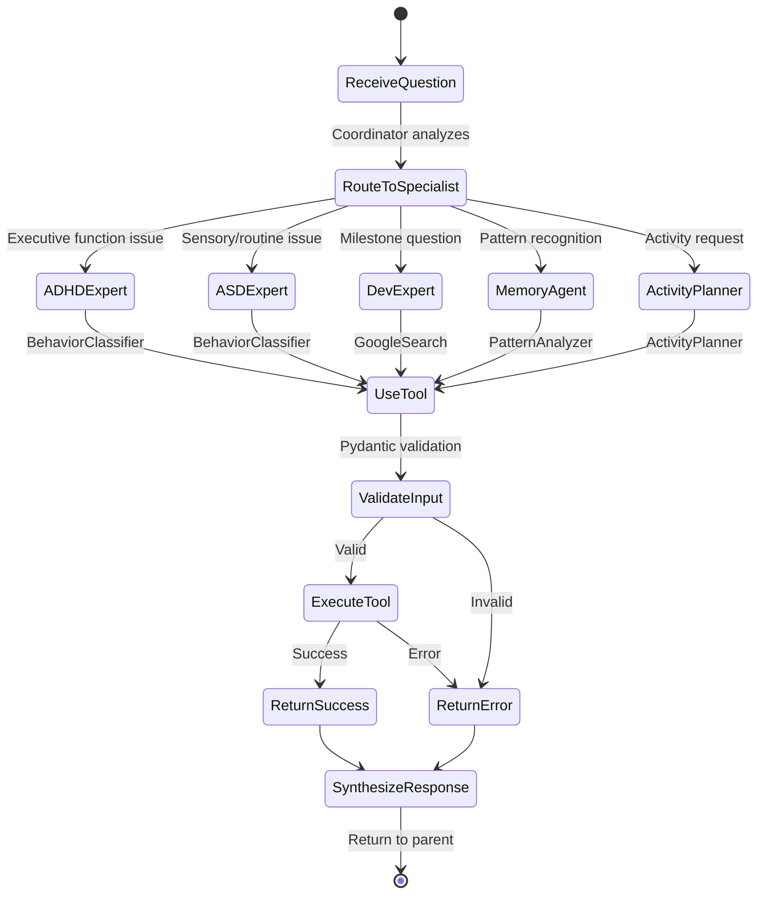
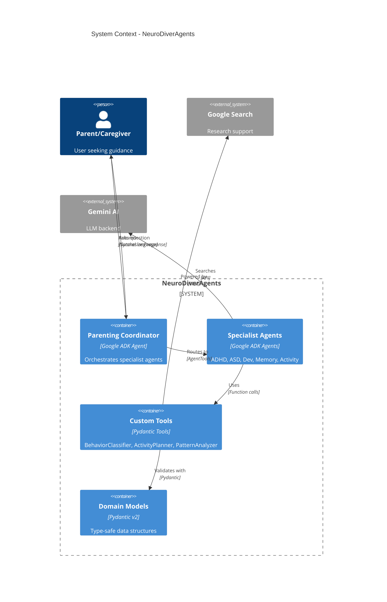

# NeuroDiverAgents Architecture

## System Overview

A hierarchical multi-agent AI system for supporting parents of neurodivergent children, built with type-safe Pydantic models and Google ADK integration.

---

## Complete Architecture Diagram

---

## Detailed Component Diagram

---

## Type Safety Flow

---

## Data Flow Architecture

---

## Key Architectural Decisions

### ✅ Type Safety Everywhere
- **Pydantic v2** for all data models
- **Discriminated unions** for result handling (ToolSuccess | ToolError)
- **ConfigDict** with strict validation
- **No `Dict[str, Any]`** - only typed models

### 🎯 Hierarchical Agent Design
- **Coordinator pattern** for orchestration
- **Specialist agents** with focused expertise
- **AgentTool integration** for delegation
- **Synthesis layer** for coherent responses

### 🔧 Clean Architecture Layers
1. **Models** - Pure data structures (Pydantic)
2. **Tools** - Business logic with custom implementations
3. **Agents** - Specialist knowledge domains
4. **Orchestration** - Coordination and routing

### 🛡️ Robustness Features
- **Retry configuration** for API calls
- **Error handling** via discriminated unions
- **Input validation** at every boundary
- **Agent caching** for performance

### 📊 Domain-Driven Design
- **BehaviorFactor enum** (ADHD, ASD, Age)
- **Clear domain models** (behavior, activity, strategy, memory)
- **Bounded contexts** per specialist
- **Ubiquitous language** in model naming

---

## Technology Stack

---

## Agent Communication Pattern

---

## Deployment Architecture

---

## Summary

**NeuroDiverAgents** demonstrates enterprise-grade Python architecture:

- ✅ **Type-safe throughout** - Pydantic models with ConfigDict
- ✅ **Discriminated unions** - ToolSuccess | ToolError pattern
- ✅ **Layered architecture** - Models → Tools → Agents → Orchestration
- ✅ **Clean separation** - Business logic, infrastructure, domain models
- ✅ **Robust error handling** - Validation at boundaries, retry logic
- ✅ **Scalable design** - AgentFactory, caching, tool wrappers
- ✅ **Domain-driven** - Clear bounded contexts per specialist

**Perfect demonstration of modern Python best practices for AI systems.**
